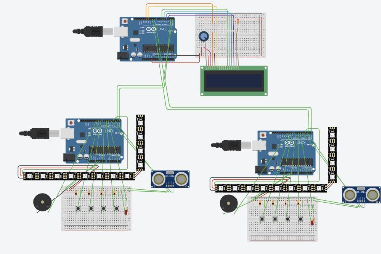

## Guitarduino: An Arduino Based Rhythm Game

## Overview
**Guitarduino Hero** is a competitive, "Guitar Hero" style hardware game built using three synchronized Arduino Uno nodes. 

The system features a central host that coordinates real-time gameplay, tracks scoring multipliers, and manages the UI, while two player controller devices handle input debouncing and custom graphics rendering on 8x32 LED matrices.

**Documentation Note:** For the full description of Materials, circuit schematics, and step-by-step assembly guide, please refer to the [Design Document PDF](./docs/guitarduino_design_doc.pdf).
## System Architecture

<figure>
  
  <figcaption><small><em>Note: The LED matrices are represented by segmented bar strips for visualization; however, the actual hardware utilizes MAX7219 8x32 LED Matrices via the SPI pins (D13, D11, and CS). </em></small></figcaption>
</figure>

  The project utilizes a distributed architecture to minimize input-to-audio-visual latency:

+ **Host (1x Arduino Uno)**: Manages game states, tracks scores/multipliers, and drives the 16x2 LCD display for showing game results.

+ **Player Nodes (2x Arduino Uno)**: Handle button debouncing, buzzer sounds, ultrasonic distance sensing, and driving the LED matrix animations.

+ **Communication**: Inter-device communication is handled via a mix of Hardware UART and `AltSoftSerial`, using a custom packet-based protocol for low-latency hit/miss reporting.

## Key Engineering Features

+ **Asynchronous Timing**: Implemented `millis()` based state machines to ensure non-blocking execution across all nodes.

+ **Custom Font Rendering**: Developed a custom character map to represent complex button combinations as single-byte characters.

+ **Bitwise Optimization**: Optimized button-reading logic from 15+ conditional statements to a single 4-bit register read, reducing instruction overhead.

##  Post-Mortem: Challenges, Design Evolution & Lessons Learned:

### Architectrual Refactors

1.  **Eliminating Blocking Loops:** Initial prototypes used `while()` loops for ultrasonic polling, which "blinded" the nodes to incoming Serial data.
    * **Fix:** Refactored to an asynchronous `switch` state machine, allowing the nodes to simultaneously poll sensors and listen for game-start packets.
2.  **Buffer Management & Latency:** The use of `Serial.readBytes()` (a blocking call) and heavy string concatenation caused "buffer bloat," leading to visible lag on the LCD.
    * **Fix:** Optimized the Host node to use non-blocking `Serial.read()` and streamlined LCD updates to clear the Serial buffer in real-time.

### Design Flaws  to Learn From

+ **Code Duplication:** The current player nodes use separate (but nearly identical) sketches that require manual modification to distinguish between palyers. A more professional "DRY" (Don't Repeat Yourself) approach would involve a single codebase using a jumper pin to assign Player IDs (P1 vs P2).
* **Decoupling Timing (The "Magic Number" Fix):**  The original demo used a hard-coded `4150ms` delay to sync note travel time. 
    * **Fix:** The current version utilizes a state-driven "heartbeat" with `roundIter`. *Note: Due to hardware no longer being available for physical recalibration, these values represent the architectural fix rather than a final tuned state.*

## Academic Context
This project was originally developed for CS 362 (Computer Design) at the University of Illinois Chicago.
**Team:** Semih Kesler, Daniel Rodriguez, and Michael Ruch.